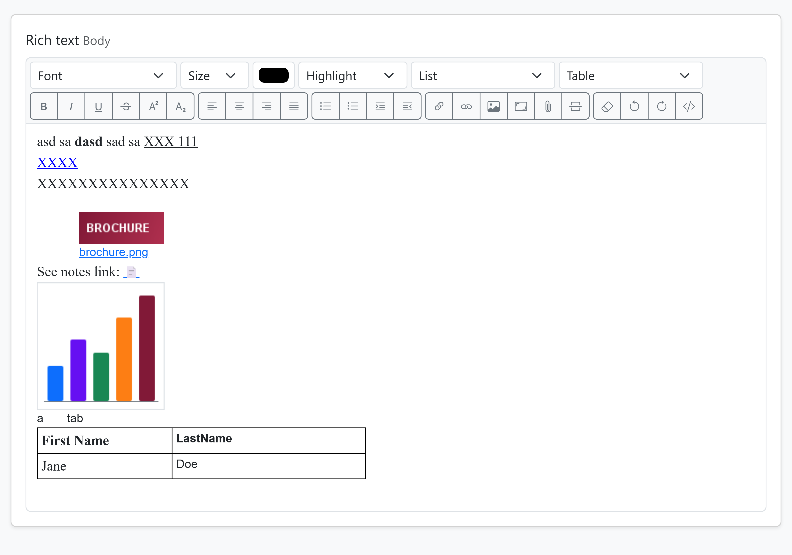

# Domino WYSIWYG

A Notes rich-text field on the web - edited from both ends. For HCL Domino web applications.

Show a Notes rich-text field in a web page as Notes shows it, edit it in a WYSIWYG editor, and save it back **as classic Notes rich text** - so the same field can be edited from the Notes client and from the browser, and each end sees what the other did.

Version 1.0.2 (2026-09-29). Java 8, tested on Domino 12. Apache License 2.0. See [CHANGELOG.md](CHANGELOG.md).



## What it does

- **Reads** classic rich text from the item's DXL and renders it element by element: fonts, sizes, colours, the three Notes highlights, alignment, indents, bullet and numbered lists of every Notes type, tabs, tables (widths, borders, colours, spans), pictures, URL links, doclinks, view and database links, attachment icons. MIME (mail-style) bodies are shown as they are, read-only.
- **Writes** what the editor posts back as classic rich text through a DXL import - not as MIME/HTML. Whatever the user did not touch goes back **exactly as it was**: the original paragraph definitions, pictures (a Notes bitmap stays a Notes bitmap), doclinks, attachment icons, table settings and list types are reused, not rebuilt.
- **Keeps what the web cannot edit.** Hotspots, buttons, popups, sections, computed text, pass-thru HTML, paragraphs hidden in Notes and elements it does not know are shown as *islands*: visible, not editable, written back verbatim. Deleting one deletes it. Only an OLE object (or a body over 8 MB) makes a body read-only, and the page can say why.
- **Posts only what changed.** A body the user did not touch is never sent, so saving the other fields of a form can never flatten a rich-text field.
- **Attaches files** from the editor, stored as real Notes attachments with an icon in the text. Deleting an icon deletes the file, as in Notes.
- **Reports.** A plain-text report of how a body converts (and of any failed save) that a user can copy and send to the developer.
- **Is safe to show.** Everything that reaches the page passes an allowlist HTML sanitizer; the page markers that point at a document's own pictures and hotspots cannot be forged to reach another document's.

## Requirements

- Domino 12 (every API used exists since Domino 9.0.1; not tested there), Java 8 bytecode. The two classes need only `Notes.jar`.
- A server-side Java that renders pages and handles POSTs: a Java web agent, an XPage bean, a servlet. The examples use a Java agent that runs as the web user.
- A browser with `contenteditable` and `execCommand`: every current desktop browser.
- As shipped, the toolbar uses Bootstrap 5.3 classes (`btn`, `form-select`...) and Bootstrap Icons. Without Bootstrap, restyle the few classes in `buildToolbar()`; nothing else depends on it.

## What is in the box

    java/net/prominic/RichText.java        the reader, the writer, the reports
    java/net/prominic/HtmlSanitizer.java   the allowlist sanitizer (the XSS gate)
    web/rich-text-kit.js                   the kit block (post only changed bodies) + the WYSIWYG editor
    web/rich-text-kit.css                  the styles: bodies, editor, islands, list types
    example/java/...                       a GET handler, a POST handler, a report handler, a logger
    example/templates/                     the page and report templates (Mustache)
    tools/                                 the offline checks - run them after copying (see Verify)
    demo/                                  the reference application, ready to build in Designer (nsf/ + ui/)
    LICENSE, NOTICE                        Apache License 2.0
    CHANGELOG.md, CONTRIBUTING.md, SECURITY.md

Each of `demo/`, `example/` and `tools/` has a README of its own.

## Try it first

[demo/README.md](demo/README.md) builds the reference application on your own server in about ten minutes: a Designer import, an ACL, one configuration document. Edit a page from Notes and from the browser and watch each end pick up the other's changes. Then bring the kit into your own application as below.

## Install

1. **Java.** Copy `java/net/prominic/*.java` into a Java script library (or your source tree). Keep the package, or repackage both files together; they depend only on each other and on `lotus.domino`.
2. **Script.** Serve `web/rich-text-kit.js` on every page that shows or edits a body, or paste its content into your application script.
3. **Stylesheet.** Serve `web/rich-text-kit.css` likewise.
4. **Template.** Render a body with the markup below.
5. **GET handler.** Read the body with `RichText.read()`.
6. **POST handler.** Save your own fields first, then `RichText.write()`.

### Template

```html
{{^bodyLocked}}
<div class="rich-toolbar d-flex flex-wrap gap-1 border border-bottom-0 rounded-top bg-light p-1" data-editor="ed-body"></div>
<div id="ed-body" class="rich-editor rich" contenteditable="true" spellcheck="true" data-target="h-body">{{&bodyHtml}}</div>
<input type="hidden" id="h-body" name="body" disabled>
{{/bodyLocked}}
{{#bodyLocked}}
<div class="rich border rounded p-2 overflow-x-auto">{{&bodyHtml}}</div>
<p class="form-text">Read-only here - it holds {{bodyLockReason}}, which the web editor cannot keep. Edit it in Notes.</p>
{{/bodyLocked}}
```

The contract:

- `.rich-toolbar[data-editor]` names its editor; `.rich-editor[data-target]` names its hidden field; the hidden field is inside the form that posts.
- **The hidden field is rendered `disabled`.** The script enables it only for an editor that changed. Not posted means not changed.
- `.rich` on any container of a body, read-only or editor: it gives the Notes default font (Sans Serif 10pt) to text without a font of its own.
- **Only kit output goes into `{{&...}}`** (unescaped). The sanitizer is the XSS gate; nothing else must be printed raw.
- Several bodies on one page: one toolbar and one hidden field each, all in the same form or in different ones.

### GET handler

```java
RichText rich = new RichText(session)                 // one per request, BEFORE the documents are opened
        .attachments("https://host/dir/data.nsf")     // optional: attachment icons link to their files
        .docLinks(db.getReplicaID(),                  // optional: a doclink into this database...
                baseUrl + "/router?openagent&req=page&unid=",   // ...opens your own page for it, and
                pagesView.getUniversalID());          // a link to such a page becomes a doclink on save

RichText.Body body = rich.read(doc, "Body");
data.put("bodyHtml", body.html);           // {{&bodyHtml}}
data.put("bodyLocked", body.locked);       // true: read-only, no editor
data.put("bodyLockReason", body.reason);   // "an embedded OLE object"
if (rich.firstError() != null) log("rich text: " + rich.firstError());   // once per page
// ...
rich.recycle();                                       // when the request is over (optional)
```

- Any item type is safe to read: classic rich text, MIME, plain text, a missing item (`""`).
- Only the one item is exported (`DxlExporter.setRestrictToItemNames`); nothing is changed on the server. The constructor calls `Session.setConvertMime(false)` so MIME items arrive as MIME: **construct it before opening any document** - a document opened earlier in the request has its MIME already converted, and neither the kit nor `getMIMEEntity()` can see it. The example `BaseAbstract.getPage()` constructs the kit first for that reason.
- Pictures are inlined as `data:` URIs within a budget per request (`pictureBudget(bytes)`, default 2 MB); a picture over the budget shows as a note and is still kept on save.
- `unknownElements()` names DXL elements the renderer does not know (they are kept as islands); worth a hint on the page.

### POST handler

```java
doc.replaceItemValue("Subject", posted...);   // your own fields first
doc.save(true, false);

String body = web.getParam("body");           // null = the editor was not touched
if (body != null) {
    for (int n = 1; n <= 20; n++) {           // files attached in the editor: newfileN = "name|base64"
        String file = web.getParam("newfile" + n);
        int bar = file == null ? -1 : file.lastIndexOf('|');
        if (bar > 0) rich.attach(String.valueOf(n), file.substring(0, bar), file.substring(bar + 1).trim());
    }
    rich.write(doc, "Body", body);            // recycles doc - use nothing of it afterwards
}
```

`write()` throws with a plain message when the save could not be made (the document is left, or put back, as it was), and `rich.writeReport()` then holds everything the developer needs: the posted HTML, the rich text made of it, the importer's log. Log it and link it; the example `PageSavePost` + `ReportPageGet` show how.

Guard the POST size: a body with large pasted pictures can exceed what your request layer delivers. Refuse a POST whose content is shorter than its `Content-Length` before reading any parameter (`PageSavePost.requireCompletePost` in the examples).

If your application used to post every body on every save, add a marker field to the new form and refuse a POST without it: a page opened before the upgrade still runs the old script.

## The editor

Every control writes only what maps back to Notes rich text:

- Font (the three Notes defaults and common fonts), size in points, colour, the three Notes highlights, bold, italic, underline, strike, superscript, subscript.
- Left, center, right, justify; indent and outdent; the Tab key types a tab.
- Bullet and numbered lists, and a List menu with the Notes types: letters, roman, check marks, circles, squares.
- Link: a web address, a `notes://` link, or the address of one of your pages (a doclink); on an existing link the button edits it; Remove link.
- Picture (PNG/GIF/JPEG up to 2 MB, a pasted screenshot too); Picture size.
- Attach file (3 MB per save, 20 files).
- Table menu: insert; row above/below; column left/right; delete row, column, table.
- Horizontal rule, clear formatting, undo, redo, HTML source.

When the server refuses a save, the page comes back with the error and the editor's content is put back from a draft kept in the browser's session storage, so nothing typed is lost (files attached in that attempt must be attached again). The toolbar shows the font, size, list type and the active buttons at the cursor. Islands are grey and cannot be typed into; a paragraph hidden in Notes is hidden when reading and shown dimmed, marked, when editing.

## What round-trips

"Island" = shown by its content, not editable, written back exactly as it was.

| Notes (DXL) | On the page | Written back |
|---|---|---|
| paragraph + its definition (spacing, margins, keep-with-next...) | `div data-pd` | the original definition, with the alignment and indent the page shows laid over it |
| lists of any Notes type | `ul`/`ol data-list` | the same type; a type chosen in the List menu |
| paragraph hidden in Notes | island (hidden when reading) | as it was |
| runs: font, size, colour, styles, highlight | `span style`, `b i u s sup sub` | runs (the Default fonts by their Notes names) |
| shadow, emboss, extrude on a run | `span data-fx` | the same effects |
| horizontal rule | `hr data-hr` | the original rule with its colour, width, height |
| pass-thru HTML run | island | as it was |
| line break; tab | `br`; two em spaces | break; the tab |
| picture (bitmaps arrive as GIF) | `img data-pic` | the original picture; resized = the same with a new scaled size; a new one as PNG/GIF/JPEG |
| picture the browser cannot show (CGM, over the budget) | note, kept by its place | the original picture |
| URL link | `a` | the original link with its border and target frame while its address is unchanged; else a URL link; a refused scheme is an island with its text |
| doclink, view link, database link | a link to your page or a `notes://` URL | the original element; a new one from a `notes://` URL or a page address |
| attachment icon | the icon linked to its file | the original icon; icon deleted = file deleted |
| file attached in the editor | a chip | a new icon and `$FILE` |
| table, columns, rows, cells | `table data-tbl` with widths, borders, spans, colours, vertical alignment | the original table's, rows' and cells' settings (row headers, alternate colours, cell backgrounds) while the shape is unchanged - a tabbed table keeps its tabs; what the page shows (spans, border width, colour, alignment) laid over them |
| section | island: expanded, title bold | as it was, contents included |
| action hotspot, button, popup, anchor, image map | island: their visible content | as they were |
| computed text | island "[computed text]" | as it was |
| raw records (`compositedata`), a character XML cannot hold | island showing nothing | as they were |
| OLE object | "[embedded object]" | - (the body is read-only) |
| anything else | island, name in `unknownElements()` | as it was |

Editor-made markup without an original is written as the nearest Notes form: headings as bold, larger runs; `blockquote` as indented paragraphs; `pre` as monospace; nested lists as deeper indents.

A MIME body is read part by part and shown; it is read-only on the web in this version - a web save would store classic rich text next to the note's MIME flags, which has not been verified.

## Security

- **The sanitizer is the gate.** `HtmlSanitizer.clean()` keeps an allowlist of elements, attributes, URL schemes (`http`, `https`, `mailto`, `notes`, `file`, `ftp`, relative) and CSS properties; pictures only as `data:image` or `cid:` references; comments, scripts, styles, event handlers and `javascript:` go. Its output is balanced HTML. The renderer's own output goes through it too.
- **Markers are numbers.** `data-pd`, `data-pic`, `data-tbl`, `data-keep` are indexes into the document being saved; a number out of range, or a `data-kind` that does not match, is treated as plain HTML. HTML pasted from another page loses its markers in the editor.
- **Access is Domino's.** Reading needs read access to the document; saving needs the right to change it - the DXL import runs as the same user as your agent. The report shows a document's content and belongs behind the same access as editing it.
- **Sizes, from the heap.** The whole document travels as DXL held in Java strings several times over, so the kit measures against `Runtime.maxMemory()`: a body is not read when its item is over a 24th of the heap (8 MB at most); a save is refused when the document's DXL is over a 12th of the heap ("too large to save from the web - edit it in Notes"); a document with more than 2 MB of attachments is not re-saved; files attached in one save are capped at 3 MB. **Set `HTTPJVMMaxHeapSize=256M` or more in notes.ini** - Domino's HTTP JVM has 64 MB by default, which two concurrent saves of picture-heavy bodies would exhaust, and an out-of-memory in that JVM affects every web agent on the server.
- **Encrypted fields.** A document with a sealed item is not saved from the web: the web user has no key to write it back. Signed items are re-imported by the web user (their signature is not kept) - see "Not covered".

## How a save works

1. The whole document is exported as DXL, attachments included, from a fresh handle.
2. The posted HTML becomes a DXL `<richtext>`. Wherever it still points at an original element, that element is written back as it was.
3. That item is swapped in the DXL; the `$FILE` of a deleted icon goes too; new files come in as `$FILE` items.
4. The document's last-modified time is compared with the export's: a save from elsewhere in between stops the save.
5. The document is imported with REPLACE and read back (form, item type, attachments). If anything is off, the original DXL is imported back and `write()` throws.

The pointers the page carries, all numbers into the document being saved:

| Marker | On | Points at | Written back as |
|---|---|---|---|
| `data-pd` | `div`, `li`, `p` | the paragraph's definition (pardef id) | that definition, with the alignment and indent the page shows laid over it |
| `data-pic` | `img`, or a `span` note | the n-th picture | the picture as Notes had it (a new size becomes `scaledwidth`/`scaledheight`) |
| `data-cap` | `span` after a picture | the picture's caption | nothing (the picture carries it) |
| `data-tbl` | `table` | the n-th table | its settings, columns, row and cell attributes while the shape matches |
| `data-hr` | `hr` | the n-th rule | the rule as it was |
| `data-fx` | `span` | not a pointer: shadow / emboss / extrude of the run | the same effects on the run |
| `data-list` | `ul`, `ol` | the Notes list type | that type; absent = the original's when of the same family |
| `data-keep` + `data-kind` | `span`, `div` (`contenteditable="false"`) | the n-th island and its element name | the element verbatim (pardef ids remapped, attachments kept) |
| `data-file` | `span` chip | a file posted as `newfileN` | a new attachment icon and `$FILE` |

A marker out of range, or a `data-kind` that does not match, is plain HTML; `HtmlSanitizer` admits the markers only on those elements and only as digits (or a lowercase word for `data-kind` and `data-list`).

## Verify

Offline, from `tools\` (Windows with a Notes or Domino install for the JVM, `Notes.jar` and the DXL DTD - found by itself, or `-NotesRoot`; Node 22+ and Edge or Chrome for the browser checks; details in [tools/README.md](tools/README.md)):

    powershell Check-RichTextKit.ps1                # this kit's files
    powershell Check-RichTextKit.ps1 -Library <your utils.javalib> -Script <your app.js>
    powershell Check-RichTextKit.ps1 -JavaDir <your src folder> -Script <your app.js>

It compiles the two classes on their own (so no dependency crept in), runs the sanitizer and renderer on fixtures, proves render → write → render is the identity and that every generated `<richtext>` is valid against Domino's own DTD, runs the script's kit block alone, drives every toolbar control in a headless browser, and pushes the fixtures through the real editor and back (the "cycle"). Expected: `RICH-TEXT KIT: ALL OK`.

On the server:

1. A Notes body with fonts, a link, a doclink, an attachment, a picture and a table shows all of them in place.
2. Save the page after changing only another field: the body in Notes is still the original rich text.
3. Edit a word on the web and save: in Notes it looks the same apart from the word; the doclink is a doclink, the attachment opens, pictures, table and fonts are unchanged.
4. Edit it in Notes: the web shows the same.
5. Delete an attachment icon on the web and save: the file is gone in Notes, no orphan at the bottom.
6. A body with a hotspot, a section, computed text or a hidden paragraph opens editable, the islands grey; after a web edit elsewhere they still work in Notes.
7. Attach a file, link a word to another page, resize a picture, choose a lettered list: each shows in Notes as expected.
8. If a save reports "the document was put back as it was", open the report it links and send it.

## Not covered

- Creating action hotspots, buttons, sections or computed text on the web (they hold formulas or code); editing the text inside one. The web keeps and deletes them.
- OLE objects: a body with one stays read-only on the web.
- Line and paragraph spacing, cell merging, per-cell borders: kept as they are, not editable.
- Row spans: the table menu works by column position; a cell spanning rows is not split or joined.
- Encrypted items block a web save (by design); what the import does to a signed item's signature and to the document's `$UpdatedBy`/`$Revisions` history is not yet verified on a server.
- MIME (mail-style) bodies are read-only on the web.

## Support

The first line of every report names the kit version (`RichText.VERSION`). Send the report page's text with a problem: it holds the Notes source of the body, shortened, and what the page made of it. See [CONTRIBUTING.md](CONTRIBUTING.md), and [SECURITY.md](SECURITY.md) for anything that looks like a way past the sanitizer.

## License

Copyright 2026 Prominic.NET. Licensed under the Apache License, Version 2.0 - see [LICENSE](LICENSE) and [NOTICE](NOTICE). The toolbar uses Bootstrap and Bootstrap Icons (both MIT) from their own distributions.

HCL, Domino and Notes are trademarks of HCL Technologies Limited. This project is independent of HCL and not endorsed by it; the names say what the kit is for.
